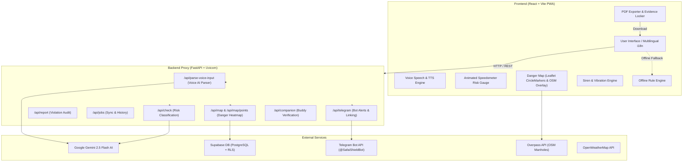

# 🛡️ SafaiShield — AI-Powered Safety & Legal Protection for Sanitation Workers

> **India's 1st offline-capable, multilingual PWA & FastAPI backend protecting 5M+ sewer and septic tank workers from toxic gas exposure, illegal manual scavenging, and rights violations.**

[](https://fastapi.tiangolo.com/)
[](https://react.dev/)
[](https://ai.google.dev/)
[](https://supabase.com/)
[](https://render.com/)
[](LICENSE)

---

## 📌 Executive Summary & Impact

Over **1,000 sanitation workers in India have lost their lives** inside septic tanks and sewers over the past decade. The primary causes include **unmonitored hydrogen sulfide ($H_2S$) and methane ($CH_4$) buildup**, lack of mechanical ventilation, heatstroke, and illegal forced entry without Personal Protective Equipment (PPE)—direct violations of **Section 7 of the Prohibition of Employment as Manual Scavengers Act, 2013**.

**SafaiShield** is a zero-latency, life-saving protection system that empowers workers with real-time hazard classification, automated voice dead-man switch monitoring, instant emergency Telegram alerts & native SMS fallback, and cryptographically signed PDF evidence generation for legal rights enforcement.

---

## 🌟 Key Features & Recent Enhancements

### 🎙️ 1. Single-Command Multilingual Voice Input (`POST /api/parse-voice-input`)
- **Full Form Voice Fill**: Worker speaks a single sentence (e.g., *"Septic tank, last cleaned 3 months ago, no rain, 10 feet deep, no ventilation"*) in **English, Hindi, Telugu, or Tamil**.
- **Backend Gemini AI Parsing**: `POST /api/parse-voice-input` extracts structured JSON parameters (`site_type`, `last_cleaned`, `recent_rain`, `depth_feet`, `has_ventilation`, `has_gas_detector`) with offline rule-based fallback.
- **Audio Feedback**: Speaks back confirmation aloud (*"I heard: Septic Tank, last cleaned 1-6 months, no rain. Is this correct?"*) using `SpeechSynthesis`.
- **Live Interim Feedback**: Displays real-time speech-to-text interim transcript under the mic button.

### 🧠 2. Pre-Entry Hazard Score Gauge & Heatstroke Detector
- **Speedometer Arc Gauge**: Half-circle SVG arc (`radius = 80`, `d="M 20 100 A 80 80 0 0 1 180 100"`) animated from 0 to target score (0–100) over 1.2 seconds via `requestAnimationFrame`.
- **Color-Coded Tiers**: Low risk (0–35 `#16A34A` Green), Medium risk (36–65 `#D97706` Amber), High risk (66–100 `#DC2626` Red).
- **Heatstroke Alert Card**: Displays pulsing heatstroke warnings (*"Heatstroke risk is HIGH today. Underground spaces trap heat. Safe window reduced to 6 minutes."*) when ambient temperatures exceed 35°C.

### ⏱️ 3. Voice-Activated Dead Man's Switch (Descent Guardian)
- **90-Second Check-In Timer**: Speaks check-in question aloud in worker's selected language (*"Are you okay? Say yes to confirm."*, Hindi, Telugu, Tamil).
- **10-Second Listening Window**: Starts `SpeechRecognition` automatically after TTS completes with pulsing red ring mic indicator.
- **Keyphrase Parsing**:
  - **Safe Words** (*"yes", "okay", "ok", "haan", "theek", "avunu", "aamaam", "safe"*): Resets timer, logs `"Voice: OK"`.
  - **Distress Words** (*"no", "help", "nahi", "ledu", "illai", "emergency", "danger"*): Fires immediate alarm, logs `"Voice: DISTRESS"`.
  - **No Response Timeout**: Increments missed check-in count, logs `"Voice: No response"`.
- **Tap Fallback**: Includes a large `"I AM OKAY"` button override during the voice window logging `"Tap: OK"`.

### 🗺️ 4. Interactive Danger Map & OSM Manhole Overlay
- **CircleMarkers & Badges**: Renders risk-colored `CircleMarker` elements (radius 14, white border) with incident count badges for merged grid locations.
- **Formatted Popups**: Displays site type (*"Septic Tank"*), risk level, 30-day incident counts, formatted month/year (*"July 2026"*), PPE gear compliance, and anonymous site reporting CTA.
- **Filters**: "All", "Sewer Manhole", "Septic Tank", and 2km Haversine **"Near Me"** distance filtering with GPS permission toast.
- **15 Indian City Seed Points**: Pre-seeded demo incident rows across Hyderabad, Chennai, Mumbai, Delhi, Bengaluru, Pune, Kolkata, Ahmedabad, Lucknow, Patna.
- **OSM Manholes Toggle**: Fetches real-time manhole nodes from Overpass API (`node[man_made=manhole]`) as grey dots with map legend.

### 📱 5. Emergency SMS Fallback & National Helpline CTA
- **Native Offline SMS**: Dispatches an emergency SMS using `sms:{phone}?body=...` scheme (`"EMERGENCY: SafaiShield alarm triggered. Location: 17.3850°N, 78.4867°E. Call 14473 immediately."`) when alarm fires, operating without active cellular data.
- **Calling CTA**: Displays an 80px high, red pulsing **`📞 CALL 14473 NOW`** button using `tel:14473` filling the alarm overlay screen.

### ⚖️ 6. AI Legal Rights Advisor & Evidence Locker
- Evaluates contractor compliance against the **Manual Scavengers Act 2013** & **NAMASTE Scheme**.
- **Cryptographic SHA-256 Evidence Signing**: Hashes worker safety logs into digital tamper-proof signatures.
- **Printable PDF Export**: Generates legal evidence reports directly in the browser.

---

## 🏗️ System Architecture



---

## 🛠️ Technology Stack

| Layer | Component | Description |
|---|---|---|
| **Frontend** | React 18, Vite, TailwindCSS, Leaflet | Fast, responsive PWA with offline caching & interactive Leaflet maps |
| **Backend API** | FastAPI, Uvicorn, Pydantic v2 | High-performance Python async REST service |
| **AI Models** | Google Gemini 2.5 Flash | Pre-entry voice parsing, risk scoring & legal report generation |
| **Database** | Supabase (PostgreSQL + RLS) | Private job logs & public anonymized map data |
| **Alert System** | Telegram Bot API & Native SMS | Instant emergency broadcasts, buddy pairing & offline SMS fallback |
| **Map Data** | Leaflet, CARTO Dark Tiles, Overpass API | Danger heatmap CircleMarkers, grid merging & real OSM manhole overlay |
| **Evidence Locker** | Web Crypto API (SHA-256) | Cryptographically signed evidence hashes |
| **PDF Engine** | Browser Print Engine | Clean printable A4 PDF evidence exports |
| **Deployment** | Render.com | Automated cloud hosting via `render.yaml` Blueprint |

---

## 📁 Repository Structure

```text
SafaiShield/
├── package.json                # Root package delegating npm run dev/build to frontend
├── frontend/                   # React PWA Application
│   ├── src/
│   │   ├── components/         # Reusable UI, Map, Risk, Guardian & Voice components
│   │   ├── context/            # Worker, Session, and Alert Context providers
│   │   ├── hooks/              # Offline AI, Geolocation, Timer, Voice & VoiceCheckIn hooks
│   │   ├── lib/                # API proxy, Gemini, Supabase, Telegram & PDF exporter
│   │   ├── pages/              # PreEntryCheck, DescentGuardian, RightsAdvisor, DangerMap, etc.
│   │   └── translations/       # Multilingual dictionaries (EN, HI, TE, TA)
│   ├── package.json
│   └── vite.config.js
│
├── safaishield-backend/        # FastAPI Python Service
│   ├── routers/                # 8 API Route modules (voice, check, report, jobs, map, etc.)
│   ├── services/               # Gemini AI, Supabase DB, Telegram & Fallback services
│   ├── main.py                 # FastAPI application entry point & CORS configuration
│   ├── config.py               # Pydantic Settings & environment loader
│   ├── schemas.py              # Pydantic Request/Response models
│   ├── prompts.py              # Gemini AI System Prompts
│   ├── supabase_schema.sql     # PostgreSQL database schema & RLS policies
│   └── requirements.txt        # Production dependencies
│
├── render.yaml                 # One-click Render.com deployment Blueprint
├── .env.example                # Template environment file
├── .gitignore                  # Production secret exclusion rules
└── README.md
```

---

## 🚀 Quick Start Guide (Local Setup)

### 1. Prerequisites
- **Node.js**: v18 or higher
- **Python**: v3.10 or higher
- **Git**

### 2. Run Entire App from Root
```bash
# Clone the repository
git clone https://github.com/ABHAYA-SARAN-NAYAK/SafaiShield.git
cd SafaiShield

# Start frontend
npm run dev
```

### 3. Backend Setup
```bash
# Navigate to backend directory
cd safaishield-backend

# Install dependencies
pip install -r requirements.txt

# Create local environment file from example
cp .env.example .env

# Start FastAPI server
python -m uvicorn main:app --reload --port 8000
```
*The interactive API documentation will be live at [http://localhost:8000/docs](http://localhost:8000/docs).*

---

## 🗄️ Database Setup (Supabase)

1. Open your [Supabase Dashboard](https://supabase.com/dashboard) and create a new project.
2. Navigate to the **SQL Editor**.
3. Copy and execute the contents of [`safaishield-backend/supabase_schema.sql`](safaishield-backend/supabase_schema.sql) to create the 5 required tables (`jobs`, `danger_map_points`, `worker_profiles`, `telegram_link_codes`, `companion_sessions`) and Row-Level Security policies.

---

## 🌐 Deploying to Render.com

This repository includes a pre-configured [`render.yaml`](render.yaml) Blueprint file for one-click deployment:

1. Push your repository to **GitHub**.
2. Log in to [Render.com](https://dashboard.render.com/) and click **New +** -> **Blueprint**.
3. Select your repository (`SafaiShield`). Render will automatically provision both the **FastAPI Backend** and the **React Frontend**.
4. Set your environment keys (`GEMINI_API_KEY`, `SUPABASE_URL`, `SUPABASE_SERVICE_KEY`, `TELEGRAM_BOT_TOKEN`) in the Render Dashboard.

---

## ⚖️ Legal Framework & Helplines

- **Prohibition of Employment as Manual Scavengers Act, 2013 (Section 7)**: Prohibits hazardous cleaning of sewers and septic tanks without protective gear and safety equipment.
- **NAMASTE Scheme**: National Action for Mechanised Sanitation Ecosystem by the Ministry of Social Justice and Empowerment.
- **Emergency Helplines**:
  - **National Sanitation Helpline**: `14473`
  - **NAMASTE Scheme Support**: `14461`
  - **Emergency Response Service**: `112`

---

## 📜 License

This project is licensed under the **MIT License**. See the `LICENSE` file for details.
