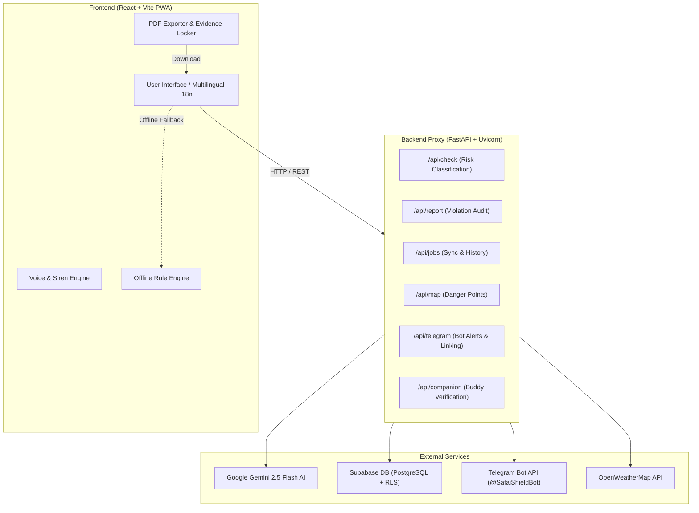

# 🛡️ SafaiShield — AI-Powered Safety & Legal Protection for Sanitation Workers

> **India's 1st offline-capable, multilingual PWA & FastAPI backend protecting 5M+ sewer and septic tank workers from toxic gas exposure, illegal manual scavenging, and rights violations.**

[](https://fastapi.tiangolo.com/)
[](https://react.dev/)
[](https://ai.google.dev/)
[](https://supabase.com/)
[](https://render.com/)
[](LICENSE)

---

## 📌 Executive Summary & Impact

Over **1,000 sanitation workers in India have lost their lives** inside septic tanks and sewers over the past decade. The primary causes include **unmonitored hydrogen sulfide ($H_2S$) and methane ($CH_4$) buildup**, lack of mechanical ventilation, heatstroke, and illegal forced entry without Personal Protective Equipment (PPE)—direct violations of **Section 7 of the Prohibition of Employment as Manual Scavengers Act, 2013**.

**SafaiShield** is a zero-latency, life-saving protection system that empowers workers with real-time hazard classification, automated dead-man switch monitoring, instant emergency Telegram alerts, and cryptographically signed PDF evidence generation for legal rights enforcement.

---

## 🌟 Key Features

### 🧠 Layer 1: Pre-Entry Hazard Check (AI & Offline Engine)
- Analyzes site type (*septic tank, sewer manhole, e-waste pit*), cleaning interval, depth, temperature, humidity, and PPE availability.
- Queries **Gemini 2.5 Flash** for real-time risk scoring (0–100), safe entry time windows, and voice guidance in **English, Hindi, Telugu, and Tamil**.
- **Offline Fallback**: Seamlessly falls back to a deterministic rule-based engine when deep underground or without internet connectivity.

### ⏱️ Layer 2: Descent Guardian & Dead Man's Switch
- Interactive 90-second safety check-in countdown timer with a 15-second grace warning.
- **Audio Siren & Vibration Alarms**: Triggers loud 600Hz emergency audio beeps and vibration patterns on missed pings.
- **Companion Pairing**: Generates a 6-digit session code & QR link for surface companions to verify safety presence.

### ⚖️ Layer 3: AI Legal Rights Advisor & PDF Evidence Locker
- Conducts post-job legal audits evaluating PPE provision, forced entry, and contractor compliance.
- Generates violation reports citing the **Manual Scavengers Act 2013** and entitlement claims under the **NAMASTE Scheme**.
- **SHA-256 Evidence Signing**: Hashes job logs and safety conditions into a tamper-proof digital signature.
- **PDF Report Exporter**: One-click printable PDF report generation directly from the browser.

### 🗺️ Crowdsourced Danger Heatmap
- Visualizes hazardous sanitation sites across the region.
- Privacy-preserving coordinate rounding (~1.1km grid precision) ensures no individual worker location is ever exposed.
- Anonymous **"Break the Silence"** incident reporting system.

### 🤖 Telegram Bot Safety Companion
- Deep-links worker profiles to a dedicated Telegram bot (`@SafaiShieldBot`).
- Automatically dispatches real-time emergency broadcasts (`job_start`, `job_safe_exit`, `alarm_triggered`) to emergency contacts.

---

## 🏗️ System Architecture



---

## 🛠️ Technology Stack

| Layer | Component | Description |
|---|---|---|
| **Frontend** | React 18, Vite, TailwindCSS | Fast, responsive PWA with offline caching |
| **Backend API** | FastAPI, Uvicorn, Pydantic v2 | High-performance Python async REST service |
| **AI Model** | Google Gemini 2.5 Flash | Pre-entry risk scoring & legal report generation |
| **Database** | Supabase (PostgreSQL + RLS) | Private job logs & public anonymized map data |
| **Alert System** | Telegram Bot API | Instant emergency broadcasts & buddy pairing |
| **Evidence Locker** | Web Crypto API (SHA-256) | Cryptographically signed evidence hashes |
| **PDF Engine** | Browser Print Engine | Clean printable A4 PDF evidence exports |
| **Deployment** | Render.com | Automated cloud hosting via `render.yaml` Blueprint |

---

## 📁 Repository Structure

```text
SafaiShield/
├── frontend/                   # React PWA Application
│   ├── src/
│   │   ├── components/         # Reusable UI, Map, Risk & Voice components
│   │   ├── context/            # Worker, Session, and Alert Context providers
│   │   ├── hooks/              # Offline AI, Geolocation, Timer, and Voice hooks
│   │   ├── lib/                # API proxy, Gemini, Supabase, Telegram & PDF exporter
│   │   ├── pages/              # PreEntryCheck, DescentGuardian, RightsAdvisor, Map, etc.
│   │   └── translations/       # Multilingual dictionaries (EN, HI, TE, TA)
│   ├── package.json
│   └── vite.config.js
│
├── safaishield-backend/        # FastAPI Python Service
│   ├── routers/                # 7 API Route modules (check, report, jobs, map, etc.)
│   ├── services/               # Gemini AI, Supabase DB, Telegram & Fallback services
│   ├── main.py                 # FastAPI application entry point & CORS configuration
│   ├── config.py               # Pydantic Settings & environment loader
│   ├── schemas.py              # Pydantic Request/Response models
│   ├── prompts.py              # Gemini AI System Prompts
│   ├── supabase_schema.sql     # PostgreSQL database schema & RLS policies
│   └── requirements.txt        # Production dependencies
│
├── render.yaml                 # One-click Render.com deployment Blueprint
├── .env.example                # Template environment file
├── .gitignore                  # Production secret exclusion rules
└── README.md
```

---

## 🚀 Quick Start Guide (Local Setup)

### 1. Prerequisites
- **Node.js**: v18 or higher
- **Python**: v3.10 or higher
- **Git**

### 2. Backend Setup
```bash
# Navigate to backend directory
cd safaishield-backend

# Install dependencies
pip install -r requirements.txt

# Create local environment file from example
cp .env.example .env

# Start FastAPI server
python -m uvicorn main:app --reload --port 8000
```
*The interactive API documentation will be live at [http://localhost:8000/docs](http://localhost:8000/docs).*

### 3. Frontend Setup
```bash
# In a new terminal, navigate to frontend directory
cd frontend

# Install dependencies
npm install

# Start Vite dev server
npm run dev
```
*The web app will be live at [http://localhost:5173](http://localhost:5173).*

---

## 🗄️ Database Setup (Supabase)

1. Open your [Supabase Dashboard](https://supabase.com/dashboard) and create a new project.
2. Navigate to the **SQL Editor**.
3. Copy and execute the contents of [`safaishield-backend/supabase_schema.sql`](file:///c:/Users/Deepak%20Paswan/Desktop/SafaiShield-main/safaishield-backend/supabase_schema.sql) to create the 5 required tables (`jobs`, `danger_map_points`, `worker_profiles`, `telegram_link_codes`, `companion_sessions`) and Row-Level Security policies.

---

## 🌐 Deploying to Render.com

This repository includes a pre-configured [`render.yaml`](file:///c:/Users/Deepak%20Paswan/Desktop/SafaiShield-main/render.yaml) Blueprint file for one-click deployment:

1. Push your repository to **GitHub**.
2. Log in to [Render.com](https://dashboard.render.com/) and click **New +** -> **Blueprint**.
3. Select your repository (`SafaiShield`). Render will automatically provision both the **FastAPI Backend** and the **React Frontend**.
4. Set your environment keys (`GEMINI_API_KEY`, `SUPABASE_URL`, `SUPABASE_SERVICE_KEY`, `TELEGRAM_BOT_TOKEN`) in the Render Dashboard.

---

## ⚖️ Legal Framework & Helplines

- **Prohibition of Employment as Manual Scavengers Act, 2013 (Section 7)**: Prohibits hazardous cleaning of sewers and septic tanks without protective gear and safety equipment.
- **NAMASTE Scheme**: National Action for Mechanised Sanitation Ecosystem by the Ministry of Social Justice and Empowerment.
- **Emergency Helplines**:
  - **National Sanitation Helpline**: `14473`
  - **NAMASTE Scheme Support**: `14461`
  - **Emergency Response Service**: `112`

---

## 📜 License

This project is licensed under the **MIT License**. See the `LICENSE` file for details.
